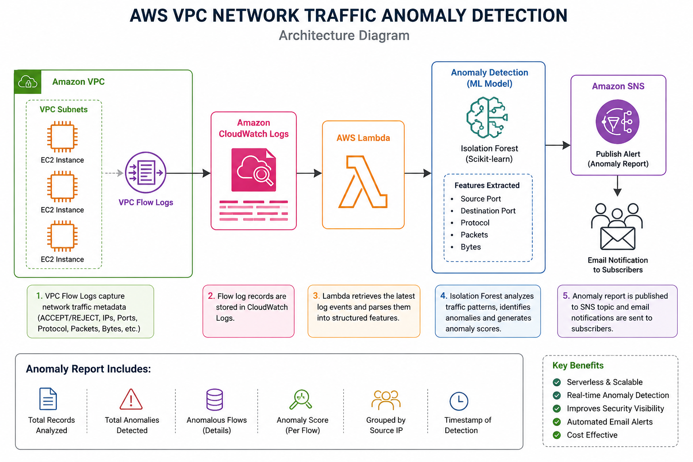
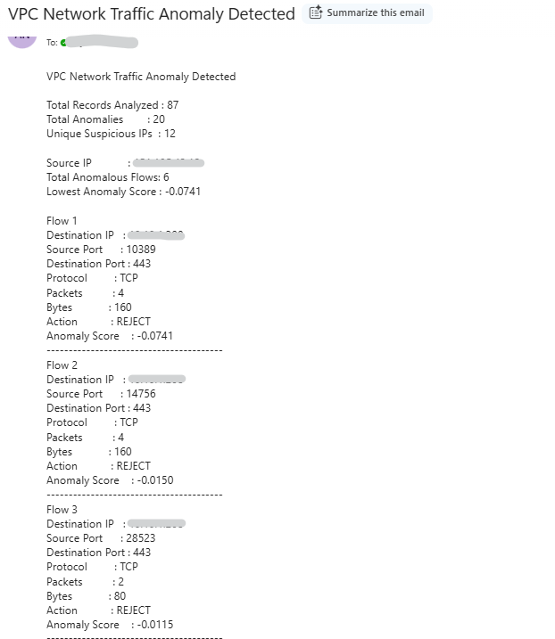

# AWS VPC Network Traffic Anomaly Detection

A serverless Machine Learning solution that analyzes Amazon VPC Flow Logs to identify anomalous network traffic using AWS Lambda, Amazon CloudWatch Logs, Isolation Forest, and Amazon SNS. The system automatically detects suspicious network behavior, groups anomalous traffic by Source IP, assigns anomaly scores, and sends detailed email notifications for security monitoring.

---

## AWS Services Used

- Amazon VPC Flow Logs
- Amazon CloudWatch Logs
- AWS Lambda
- Amazon SNS
- AWS IAM

---

## Architecture

<p align="center">
  
</p>

---

## Workflow

1. Amazon VPC Flow Logs capture network traffic metadata.
2. Flow logs are stored in Amazon CloudWatch Logs.
3. AWS Lambda retrieves the latest flow log records.
4. Network features are extracted from each log entry.
5. Isolation Forest analyzes the traffic patterns using machine learning.
6. Anomalous network flows are identified.
7. Anomaly scores are generated for each anomalous flow.
8. Anomalous flows are grouped by Source IP.
9. Amazon SNS sends an email containing the anomaly detection report.

---

## Features

- Serverless architecture using AWS Lambda
- Automated VPC Flow Log analysis
- Machine Learning based anomaly detection
- Isolation Forest based unsupervised learning
- Source IP based anomaly grouping
- Anomaly score generation
- Email notifications using Amazon SNS
- Supports multiple CloudWatch Log Streams

---

## Tech Stack

| Category | Technology |
|-----------|------------|
| Programming Language | Python |
| Cloud Platform | AWS |
| Compute | AWS Lambda |
| Logging | Amazon CloudWatch Logs |
| Networking | Amazon VPC Flow Logs |
| Notification | Amazon SNS |
| Security | AWS IAM |
| Machine Learning | Isolation Forest |
| Libraries | boto3, pandas, scikit-learn |

---

## Machine Learning

**Algorithm**

Isolation Forest

**Learning Type**

Unsupervised Learning

**Features Used**

- Source Port
- Destination Port
- Protocol
- Packets
- Bytes

**Model Output**

- Normal
- Anomaly

**Decision Metric**

Anomaly Score generated using `decision_function()`.

---

## Network Features Analyzed

Each VPC Flow Log record contains the following attributes:

- Source IP Address
- Destination IP Address
- Source Port
- Destination Port
- Network Protocol
- Packet Count
- Byte Count
- Traffic Action (ACCEPT / REJECT)

These features are used by the Isolation Forest model to identify statistically unusual network traffic patterns.

---

## Project Structure

```text
aws-vpc-network-anomaly-detection/
│
├── .gitignore
├── README.md
├── output_vpc.png
├── requirements.txt
├── vpc_flow_logs_architecture.png
└── vpc_lambda_function.py
```

---

## Environment Variables

Configure the following Lambda environment variables before deployment.

| Variable | Description |
|----------|-------------|
| SNS_TOPIC_ARN | Amazon SNS Topic ARN used to publish anomaly alerts |
| LOG_GROUP | Amazon CloudWatch Log Group containing VPC Flow Logs |

---

## Sample Output

The following screenshot shows the anomaly report generated by AWS Lambda and delivered through Amazon SNS after detecting anomalous network traffic.

<p align="center">
  
</p>

---

## Installation

Clone the repository.

```bash
git clone https://github.com/Priya-1602/aws-vpc-network-anomaly-detection.git
```

Install the required dependencies.

```bash
pip install -r requirements.txt
```

---

## Deployment

1. Create an AWS Lambda function.
2. Upload `vpc_lambda_function.py`.
3. Install the required dependencies listed in `requirements.txt`.
4. Enable Amazon VPC Flow Logs.
5. Configure an Amazon CloudWatch Log Group.
6. Create an Amazon SNS Topic.
7. Subscribe an email endpoint.
8. Configure the Lambda environment variables:
   - `SNS_TOPIC_ARN`
   - `LOG_GROUP`
9. Assign IAM permissions to allow access to:
   - Amazon CloudWatch Logs
   - Amazon SNS
10. Execute the Lambda function to analyze VPC Flow Logs.

---

## Skills Demonstrated

- AWS Lambda
- Amazon VPC Flow Logs
- Amazon CloudWatch Logs
- Amazon SNS
- AWS IAM
- Python
- Pandas
- Scikit-learn
- Isolation Forest
- Machine Learning
- Unsupervised Learning
- Network Traffic Analysis
- Infrastructure Monitoring
- Serverless Computing

---

## Author

**Priya Dharshini**

AI & Python Developer | AWS | Machine Learning | Generative AI
